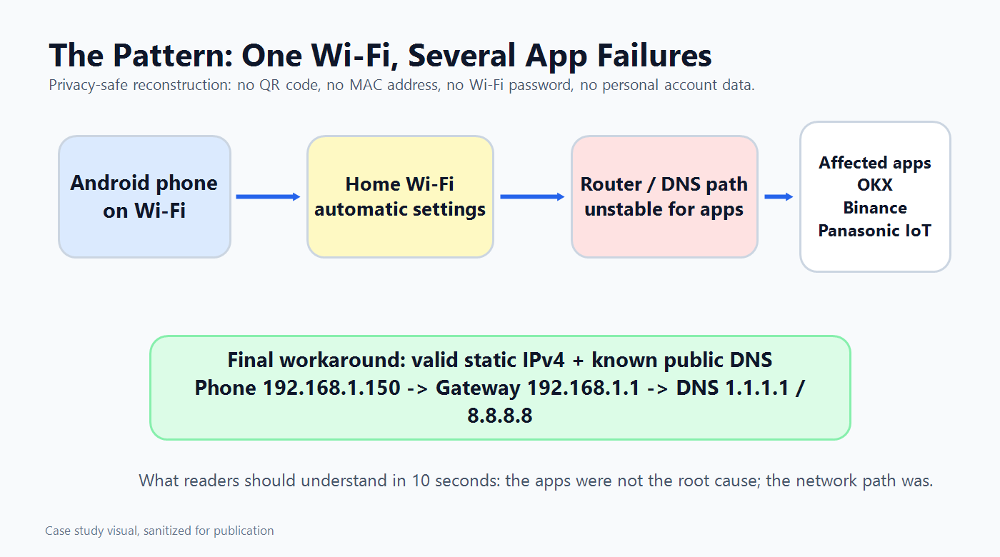
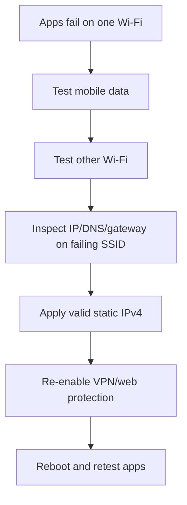
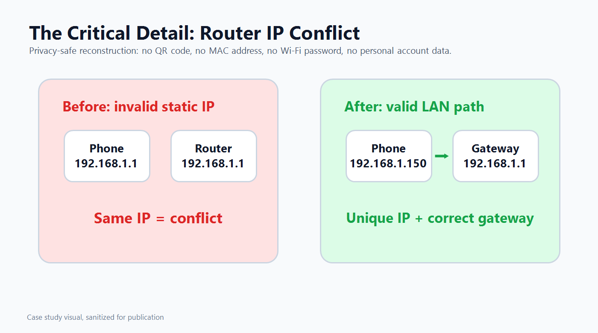
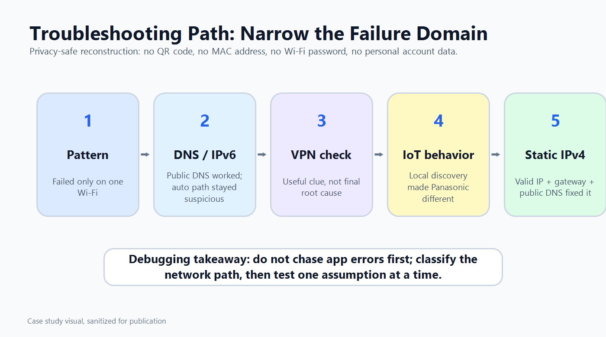

# Android Wi-Fi Debug Case Study

This repository documents a real Android network troubleshooting case: several unrelated apps failed only on one home Wi-Fi network, while the same phone and apps worked on cellular data and on other Wi-Fi networks.

The stable fix was a valid static IPv4 configuration with a unique phone IP, the correct gateway, public DNS, and no proxy.



## Case Template

Use this structure when documenting a similar connectivity issue:

1. **Symptom:** What failed, where it failed, and what still worked.
2. **Failure boundary:** Which apps, networks, and traffic paths were inside or outside the problem.
3. **Environment:** Device type, network type, router path, security layers, and privacy constraints.
4. **Hypotheses:** DNS, IPv6, VPN/web protection, app permissions, IoT local network discovery, routing, or IP assignment.
5. **Evidence:** Tests that ruled paths in or out.
6. **Fix:** The smallest stable configuration change that restores the path.
7. **Validation:** Re-enable security layers, reboot, reconnect, and confirm the fix persists.
8. **Privacy handling:** Publish sanitized reconstructions only.

## Project Overview

## Case Snapshot

| Field | Detail |
| --- | --- |
| Device context | Android phone on a home Wi-Fi network |
| Symptom | Several apps showed network errors even though Wi-Fi looked connected |
| Affected apps | OKX, Binance, and Panasonic IoT |
| Working paths | Cellular/mobile data and other Wi-Fi networks |
| Failing path | One specific home Wi-Fi network |
| Final fix | Static IPv4 configuration with unique LAN IP, correct gateway, and public DNS |
| Validation | Apps loaded, VPN and web protection were re-enabled, phone rebooted, fix persisted |
| Public handling | Sanitized diagrams and generalized private details |


## Features

- Real Android multi-app Wi-Fi failure case study
- Failure-boundary method: works on cellular / other Wi-Fi, fails on one SSID
- Exact static IPv4 recovery recipe with gateway and public DNS
- Validation after VPN and web protection are re-enabled
- Privacy-aware documentation of home network troubleshooting

## Tech Stack

- Android
- Wi-Fi / IPv4 networking
- Static IP configuration
- Public DNS (`1.1.1.1`, `8.8.8.8`)
- Optional VPN / web protection layers
- Git

## Architecture



## Folder Structure

```text
260706_Fix_WiFi_malfunction/
├── README.md
├── medium-android-wifi-debug-article.md
├── docs/
│   ├── content-pack.md
│   ├── debug-timeline.md
│   ├── final-fix.md
│   └── privacy.md
└── medium-assets/
    ├── 01-case-overview.png
    ├── 02-ip-conflict-vs-fixed.png
    └── 03-troubleshooting-path.png
```

## Installation

No install required. On the phone:

1. Open Wi-Fi details for the failing network
2. Prepare to set Static IP fields carefully

## Usage

1. Confirm the failure boundary (cellular / other Wi-Fi still work)
2. Apply the Final Working Configuration below
3. Re-enable VPN/web protection
4. Reboot and validate the previously failing apps


## Problem

Three unrelated Android apps failed only on one home Wi-Fi network:

- OKX
- Binance
- Panasonic IoT

The phone was connected to Wi-Fi, and signal strength looked normal. The failure was still real: the apps could not reliably use the path they were given by that one network.

This was not a single-app outage. It was not a total phone failure. It was not solved by reinstalling apps. The practical clue was the boundary of the failure.

## Failure Boundary

The failure boundary pointed to the network path:

- The same phone worked on cellular/mobile data.
- The same phone worked on other Wi-Fi networks.
- The affected apps failed only on one Wi-Fi network.
- Multiple unrelated apps were affected.
- The Panasonic IoT app behaved differently from ordinary outbound exchange-app traffic.
- Basic Wi-Fi connection status still looked normal.

That pattern made local network configuration more likely than app installation state. The investigation focused on DNS behavior, IPv6 DNS and routing, VPN and web-protection interception, app permissions, IoT local network behavior, and IP assignment.

## Investigation Timeline

The full timeline is also captured in [`docs/debug-timeline.md`](docs/debug-timeline.md).

1. **Initial symptom:** Several Android apps failed only on one Wi-Fi network.
2. **Network boundary:** The same apps worked on cellular data and other Wi-Fi networks.
3. **DNS and IPv6:** Public DNS could resolve relevant domains, but the automatic network configuration remained suspicious because the network also supplied IPv6 DNS.
4. **VPN and web protection:** Android showed a VPN/web-protection warning from a mobile security app. It was worth checking because VPN profiles can intercept traffic, but it was not the final root cause.
5. **IoT difference:** Panasonic IoT recovered later than the exchange apps, which made sense because IoT apps may need local network discovery, nearby-device permissions, background connectivity, cloud access, and stable LAN routing.
6. **IP conflict:** The most concrete configuration error was that the phone had previously been assigned the router's own LAN address.
7. **Final fix:** The phone received a deterministic static IPv4 setup with a valid unique IP, correct gateway, public DNS, and no proxy.
8. **Validation:** OKX, Binance, and Panasonic IoT loaded normally; VPN and web protection were turned back on; the phone was rebooted; the fix persisted.

## Critical Configuration Error

The invalid configuration was:

```text
Phone IP: 192.168.1.1
Gateway: 192.168.1.1
```

In this network, `192.168.1.1` was the router. The phone cannot use the same address as the gateway. That conflict explained why the phone could appear connected while app behavior remained unreliable.



## Final Working Configuration

The stable configuration was:

```text
Proxy: None
IP settings: Static
IP address: 192.168.1.150
Gateway: 192.168.1.1
Network prefix length: 24
DNS 1: 1.1.1.1
DNS 2: 8.8.8.8
```

Why this worked:

- `192.168.1.150` gave the phone a valid unique LAN IP.
- `192.168.1.1` kept the router as the gateway.
- Network prefix length `24` matched the local `192.168.1.x` network.
- DNS `1.1.1.1` and `8.8.8.8` gave the phone known public IPv4 resolvers.
- `Proxy: None` removed another possible interception point.
- Static IPv4 reduced dependence on the unstable automatic configuration path.

This is not a universal recommendation to use static IP on every phone. It was a practical workaround for a constrained environment where router settings were not directly changed.

## Troubleshooting Path



The investigation checked:

- DNS behavior and public resolver results
- IPv6 DNS and routing supplied by the network
- VPN and web-protection interception
- Android app permissions
- IoT local network discovery and background behavior
- Static IP conflict with the router

DNS alone was not enough. Public DNS could resolve the relevant domains, but the phone's automatic Wi-Fi path still behaved inconsistently. VPN/web protection was also not the root cause because it could be re-enabled after the static IPv4 fix and the apps still worked after reboot.

## Result

## Validation Results

After applying the final configuration:

- OKX loaded normally.
- Binance loaded normally.
- Panasonic IoT connected normally.
- VPN and web protection were re-enabled.
- The phone was rebooted.
- The static IP fix persisted after reboot.

That validation mattered because a workaround that disappears after reconnect or reboot is not stable enough to trust.

## Public Article

The long-form article version is kept in:

- [`medium-android-wifi-debug-article.md`](medium-android-wifi-debug-article.md)

## Supporting Docs

- [`docs/debug-timeline.md`](docs/debug-timeline.md): chronological investigation notes.
- [`docs/final-fix.md`](docs/final-fix.md): exact final Wi-Fi configuration.
- [`docs/privacy.md`](docs/privacy.md): public sharing and redaction rules.
- [`docs/content-pack.md`](docs/content-pack.md): resume, LinkedIn, commit, PR, and future extension copy.

## Privacy Notes

This repository intentionally does not include:

- Wi-Fi QR codes
- full MAC addresses
- Wi-Fi passwords
- personal account identifiers
- exact device identifiers
- private screenshots

Published safely:

- private LAN IP examples needed to explain the debugging case
- generalized app categories and named affected app families where useful
- sanitized diagrams
- reusable troubleshooting process

All diagrams are sanitized reconstructions.

## Reusable Checklist

When apps fail only on one Wi-Fi network:

1. Confirm whether the same phone works on cellular/mobile data.
2. Confirm whether the same apps work on other Wi-Fi networks.
3. Check whether multiple unrelated apps fail.
4. Verify that the phone IP is unique and not the router's address.
5. Verify the gateway points to the router.
6. Test known DNS resolvers such as `1.1.1.1` and `8.8.8.8`.
7. Consider whether IPv6 DNS or routing is changing the path.
8. Temporarily evaluate VPN/web-protection interception, then re-enable it for validation.
9. Treat IoT apps separately because they may need local discovery, nearby-device permissions, background connectivity, cloud access, and stable LAN routing.
10. Reboot and reconnect before calling the fix stable.

## Disclaimer

This is a personal troubleshooting case study. Network environments vary, and static IP settings should be chosen carefully to avoid IP conflicts.


## Lessons Learned

- Reinstalling apps cannot fix a path-specific network failure
- A connected Wi-Fi icon does not imply a correct L3 configuration
- Failure-boundary tests (cellular vs SSID) shrink the search space quickly
- Static IP helps only when gateway, prefix length, and DNS are all correct
- Validate again after security layers (VPN / web protection) return

## Future Improvements

- Automate Android network dump collection (IP, routes, DNS) with redaction
- Compare DHCP lease vs static as a one-tap diagnostic Agent skill
- Add a home-lab reproducible fixture using a captive/misconfigured gateway
